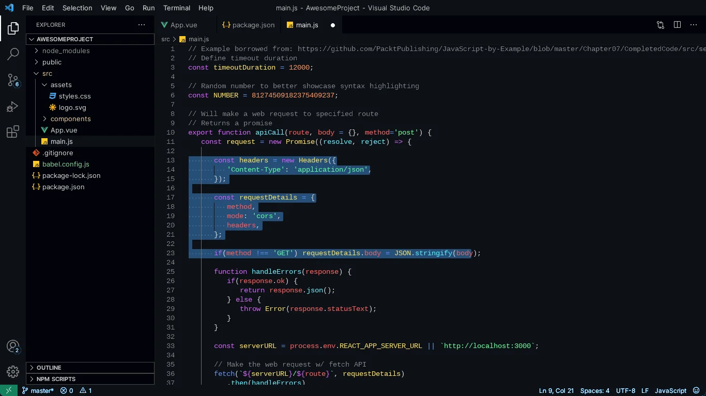
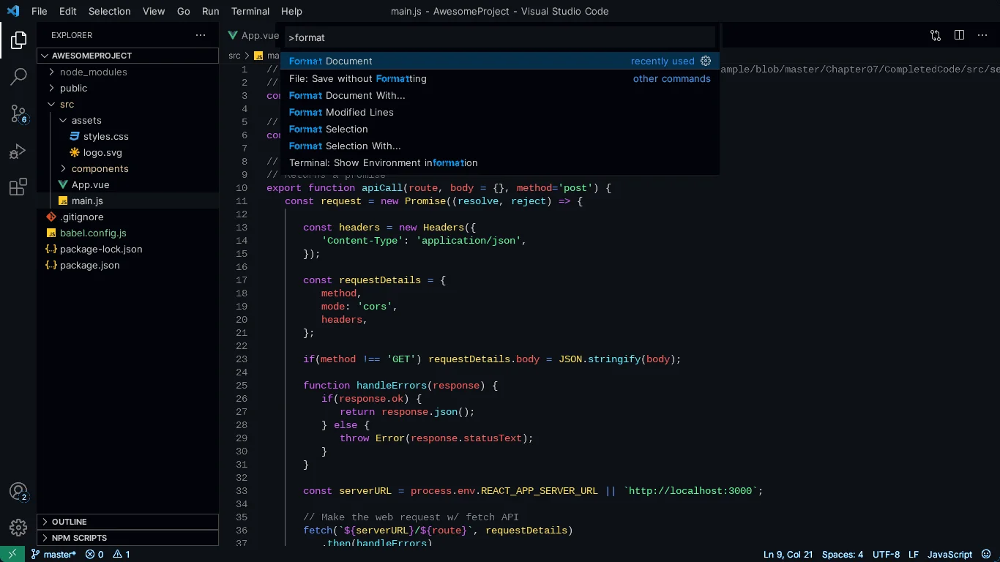

<div align="center">
  

  <h1>Alpha</h1>

  <p><strong>A VS Code theme with a quiet interface and a perceptually balanced isoluminant syntax palette.</strong><br/>Ships as <code>alpha dark</code> and <code>alpha light</code>.</p>

  <p>
    <a href="https://marketplace.visualstudio.com/items?itemName=gokhangunduz.alpha"></a>
    <a href="https://marketplace.visualstudio.com/items?itemName=gokhangunduz.alpha"></a>
    <a href="https://marketplace.visualstudio.com/items?itemName=gokhangunduz.alpha&ssr=false#review-details"></a>
    <a href="https://open-vsx.org/extension/gokhangunduz/alpha"></a>
    <a href="./LICENSE"></a>
  </p>

  <p>
    <a href="https://marketplace.visualstudio.com/items?itemName=gokhangunduz.alpha"><strong>Install</strong></a> ·
    <a href="https://gokhangunduz.github.io/alpha"><strong>Website</strong></a> ·
    <a href="./CHANGELOG.md"><strong>Changelog</strong></a> ·
    <a href="https://github.com/gokhangunduz/alpha/issues"><strong>Issues</strong></a>
  </p>
</div>

---



## Why alpha

- **Two variants.** `alpha dark` and `alpha light`. Switch with your OS, or pin one.
- **Equal-weight syntax palette.** Seven hues calibrated so no token visually dominates another — the eye reads structure, not emphasis.
- **Restrained interface.** Editor, sidebar, status bar, tabs, panels, terminal — all tuned to stay out of the way.
- **WCAG-AA on light.** Light variant retuned per hue to clear ≥ 4.5:1 contrast on white.
- **Free & open source.** MIT-licensed. No telemetry, no account, no paywall.

## Install

**From VS Code**

1. Open the Extensions panel (`⌘+Shift+X` / `Ctrl+Shift+X`).
2. Search for **Alpha**.
3. Click **Install**.
4. Run **Preferences: Color Theme** (`⌘+K ⌘+T` / `Ctrl+K Ctrl+T`) and pick **alpha dark** or **alpha light**.

**From the command line**

```bash
code --install-extension gokhangunduz.alpha
```

Or grab it directly from the [Visual Studio Marketplace](https://marketplace.visualstudio.com/items?itemName=gokhangunduz.alpha) or [Open VSX](https://open-vsx.org/extension/gokhangunduz/alpha).

## Match your system theme

To switch between dark and light automatically with your OS:

1. Open settings (`⌘+,` / `Ctrl+,`) and search for **Auto Detect Color Scheme**, enable it.
2. Set **Preferred Dark Color Theme** to **alpha dark**.
3. Set **Preferred Light Color Theme** to **alpha light**.

## The palette

The dark variant locks every syntax color at `HSL(h, 100%, 68%)` — only the hue rotates, so weights stay equal across all seven colors. The light variant keeps saturation at 100% but lowers lightness per hue so each one clears WCAG-AA contrast on white.

| Hue  | Used for           | Dark        | Light       |
| ---- | ------------------ | ----------- | ----------- |
| 0°   | variables, tags    | `#ff5c5c`   | `#ed0000`   |
| 10°  | constants, numbers | `#ff775c`   | `#d12300`   |
| 49°  | classes, types     | `#ffe15c`   | `#8c7300`   |
| 143° | strings            | `#5cff9a`   | `#008734`   |
| 186° | functions          | `#5cefff`   | `#008391`   |
| 221° | operators          | `#5c8fff`   | `#266bff`   |
| 284° | keywords           | `#d35cff`   | `#bd08ff`   |

## In action



## Contributing

Bug reports, palette suggestions, and pull requests are welcome.

- [Report a bug](https://github.com/gokhangunduz/alpha/issues/new?template=bug_report.yml)
- [Suggest a feature or color](https://github.com/gokhangunduz/alpha/issues/new?template=feature_request.yml)
- [Reach out](https://gokhangunduz.github.io/alpha/contact)

## License

[MIT](./LICENSE) © Gökhan Gündüz
