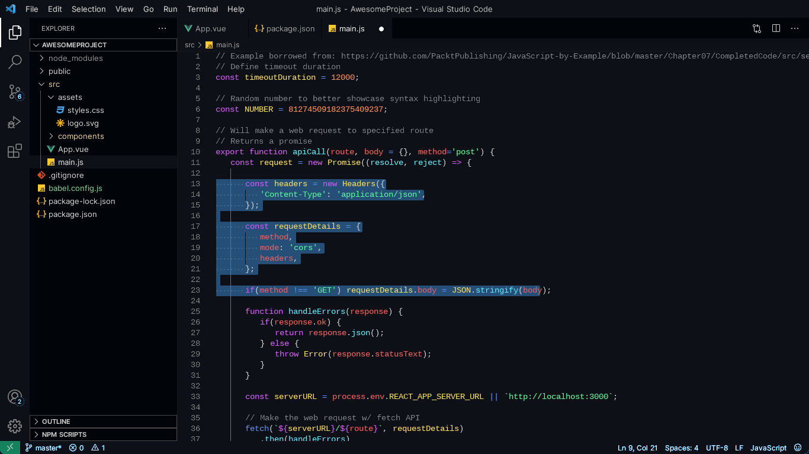

# Alpha

[](https://marketplace.visualstudio.com/items?itemName=gokhangunduz.alpha)
[](https://marketplace.visualstudio.com/items?itemName=gokhangunduz.alpha)
[](https://marketplace.visualstudio.com/items?itemName=gokhangunduz.alpha)
[](https://gokhangunduz.github.io/alpha)
[](./LICENSE)

**Website:** [gokhangunduz.github.io/alpha](https://gokhangunduz.github.io/alpha) &middot; **Changelog:** [view online](https://gokhangunduz.github.io/alpha/changelog) &middot; **Issues:** [GitHub](https://github.com/gokhangunduz/alpha/issues)

A VS Code theme in two variants — **alpha dark** and **alpha light** — that pair a clean, restrained interface with a perceptually balanced syntax palette.

The interface (chrome, sidebar, editor surfaces, terminal) is deliberately quiet so the syntax does the talking.

The syntax palette uses the same seven hues in both variants, but the lightness is tuned per background so every token reads with equal weight:

- **Dark variant:** all seven hues at HSL(`h`, 100%, 68%) — strict isoluminance.
- **Light variant:** each hue tuned to ≥4.5:1 contrast on white (WCAG-AA), saturation kept at 100%. Equal *perceived* weight across colors.



## Install

**From VS Code:**

1. Open the Extensions panel (`⌘+Shift+X` / `Ctrl+Shift+X`).
2. Search for `Alpha`.
3. Click **Install**.
4. Run **Preferences: Color Theme** and pick **alpha dark** or **alpha light**.

**From the command line:**

```bash
code --install-extension gokhangunduz.alpha
```

Or grab it directly from the [Marketplace](https://marketplace.visualstudio.com/items?itemName=gokhangunduz.alpha).

## Syntax palette

| Hue  | Used for           | Dark (L=68) | Light (per-hue L) |
| ---- | ------------------ | ----------- | ----------------- |
| 0°   | variables, tags    | `#ff5c5c`   | `#ed0000`         |
| 20°  | constants, numbers | `#ff925c`   | `#d14600`         |
| 49°  | classes, types     | `#ffe15c`   | `#8c7300`         |
| 143° | strings            | `#5cff9a`   | `#008734`         |
| 186° | functions          | `#5cefff`   | `#008391`         |
| 221° | operators          | `#5c8fff`   | `#266bff`         |
| 284° | keywords           | `#d35cff`   | `#bd08ff`         |

## Screenshots


## Contributing

Bug reports, color suggestions, and pull requests are welcome.

- [Report a bug](https://github.com/gokhangunduz/alpha/issues/new?template=bug_report.yml)
- [Suggest a feature or color](https://github.com/gokhangunduz/alpha/issues/new?template=feature_request.yml)
- [Reach out](https://gokhangunduz.github.io/alpha/contact)

## License

[MIT](./LICENSE)
